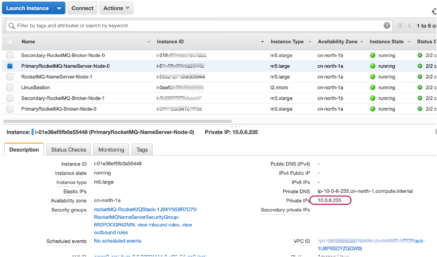
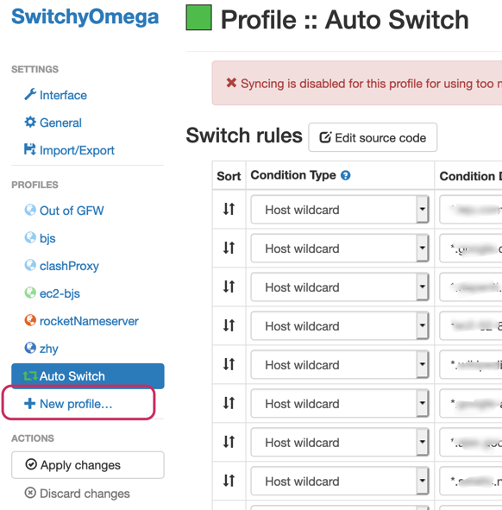
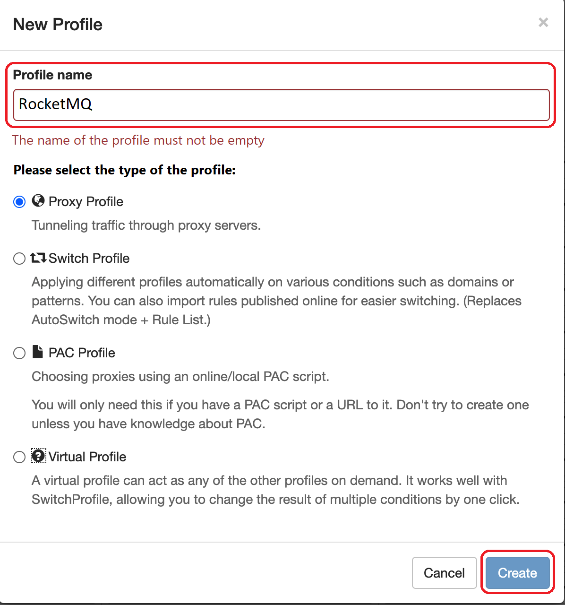
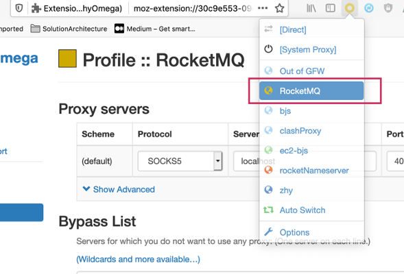
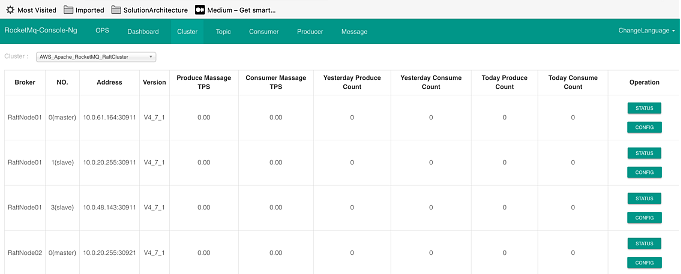

// Add steps as necessary for accessing the software, post-configuration, and testing. Don’t include full usage instructions for your software, but add links to your product documentation for that information.
//Should any sections not be applicable, remove them

=======
=== Use Apache RocketMQ
==== Apache RocketMQ deploys on EC2 with directory instructions:
NameServer Node
[cols=3*]
|===
^|
^|Directory
^|Description

^|1
^|/home/ec2-user/rocketmq-deploy/
^|Apache RocketMQ installation directory

^|2
^|/home/ec2-user/rocketmq-deploy/rocketmq-all-4.7.1-bin-release
or
/home/ec2-user/rocketmq-deploy/rocketmq-all-4. 8. 0-bin-release
^|Apache RocketMQ's application directory

^|3
^|/home/ec2-user/rocketmq-deploy/install.log
^|The installation log for the deployment script, which can be viewed if there is an error

^|4
^|/home/ec2-user/rocketmq-deploy/rocketmq-console-ng-1.0.0.jar
^|App for Apache RocketMQ   Console (only exist on Nameserver instances)
|===

Broker Node
[cols=3*]
|===
^|
^|Directory
^|Description

^|1
^|/home/ec2-user/rocketmq-deploy/
^|Apache RocketMQ installation directory

^|2
^|/home/ec2-user/rocketmq-deploy/rocketmq-all-4.7.1-bin-release
or
/home/ec2-user/rocketmq-deploy/rocketmq-all-4. 8. 0-bin-release
^|Apache RocketMQ's application directory

^|3
^|/home/ec2-user/rocketmq-deploy/install.log
^|The installation log for the deployment script, which can be viewed if there is an error

^|4
^|/home/ec2-user/rocketmq-deploy/rocketMQ-config/
^|Profile of the Apache RocketMQ Broker program, automatically generated by the deployment script

^|5
^|/home/ec2-user/rocketmq-deploy/rmqstore
^|Apache RocketMQ's local file storage directory
|===

=== How do I log in to Apache RocketMQ's Nameserver and Broker Node?
. Use the ssh-add command to add pem keypair, for example: ssh-add -k /Users/username/tmp/rocketmqXXX.pem
. Sign in to Bastion Host,
for example: ssh -A  ec2-user@ecXXXXXXXX.cn-north-1.compute.amazonaws.com.cn
. To login to Nameserver or Broker Node from Bastion Host, and how to get an IP from Nameserver or Broker node, log in to ec2 console and click on the corresponding ec2  instance, as shown in the following

[source,bash]
--
Examples:(ec2-user@ip-10-0-136-135) $ ssh 10.0.6.235

Last login: Wed Jan  6 04:55:01 2021 from ip-10-0-136-135.cn-north-1.compute.internal

       __|  __|_  )
       _|  (     /   Amazon Linux 2 AMI
      ___|\___|___|
https://aws.amazon.com/amazon-linux-2/

[ec2-user@ip-10-0-6-235 ~]$
--

. Once you're signed in to Nameserver or Broker Node, you can use Apache RocketMQ’s own command-line tools.

=== How to view Web Console from Apache RocketMQ using your browser
The current deployment scenario has Web Console applications installed on each Nameserver's instance, but since Nameserver's instance is running on the private subnet, it is not possible to access the 8080 port of the nameserver Private IP directly through a browser, please follow the steps below to establish an SSH Tunnel to Bastion host and access The Nameserver's Web Console via SSH Tunnel.

. Using the ssh command to establish a ssh connection to Bastion Host, some of the red parameters in the following image need to be replaced with parameters corresponding to the user environment
Command ：ssh -qTfnN -D PORTNUMBER -i KEYPAIR USERNAME@HOSTNAME
Example: ssh -qTfnN -D 40011  -i "rocketMQ.pem" ec2-user@ec2-54-223-36-247.cn-north-1.compute.amazonaws.com.cn
. Once you've set up ssh Tunnel, you'll need to set up proxy in your browser, which has a lot of plug-ins that automatically select Proxy, we are using Switchy Omega as an example in this article.
. To install the SwitchyOmega browser  plug-in, Edge browser please visit link:https://microsoftedge.microsoft.com/addons/detail/proxy-switchyomega/fdbloeknjpnloaggplaobopplkdhnikc?hl=en-US[this link], Firefox browser access link:https://addons.mozilla.org/en-US/firefox/addon/switchyomega/?utm_source=addons.mozilla.org&utm_medium=referral&utm_content=search[this link], Chrome browser access link:https://chrome.google.com/webstore/detail/proxy-switchyomega/padekgcemlokbadohgkifijomclgjgif?hl=en-US[this link].
. Once the Switchy Omega plug-in is installed, open the plug-in's options page and click on the "New Profile" on the left, as shown in the following image

. Enter the name of New Profile in the pop-up window and click the Create button at the bottom right, as follows:

. Enter the information for Proxy Server, as shown below, and click on the Apple changes at the bottom left, noting that the value for Port needs to be set to the local port where you set up the ssh tunnel, see the number after the first step -D parameter, as shown below:
. Click on the SwitchyOmega plug-in and select the RocketMQ profile you just created, as shown below

. After completing this step above, the browser will send all traffic through the local port 40011 proxy to the Bastion  Host machine.
. Enter the private ip address of any of the deployed Nameservers in your browser plus port 8080 (for example:http://10.0.xx.xx:8080), and you can find the corresponding instance for the nameserver via EC2 Console and find the corresponding IP address, as shown below

. The browser should be able to display the deployed RocketMQ cluster properly, as shown in the following image:

== Test the deployment
// If steps are required to test the deployment, add them here. If not, remove the heading

== Best practices for using {partner-product-short-name} on AWS
// Provide post-deployment best practices for using the technology on AWS, including considerations such as migrating data, backups, ensuring high performance, high availability, etc. Link to software documentation for detailed information.
Please check the following links from Apache RocketMQ official website for best practice of using RocketMQ:

. link:https://rocketmq.apache.org/docs/best-practice-namesvr/[Best Practice of Nameserver]
. link:https://rocketmq.apache.org/docs/best-practice-broker/[Best Practice of Broker]
. link:https://rocketmq.apache.org/docs/best-practice-producer/[Best Practice of Producer]
. link:https://rocketmq.apache.org/docs/best-practice-consumer/[Best Practice of Consumer]

== Security
// Provide post-deployment best practices for using the technology on AWS, including considerations such as migrating data, backups, ensuring high performance, high availability, etc. Link to software documentation for detailed information.

_Add any security-related information._

== Other useful information
//Provide any other information of interest to users, especially focusing on areas where AWS or cloud usage differs from on-premises usage.

_Add any other details that will help the customer use the software on AWS._
